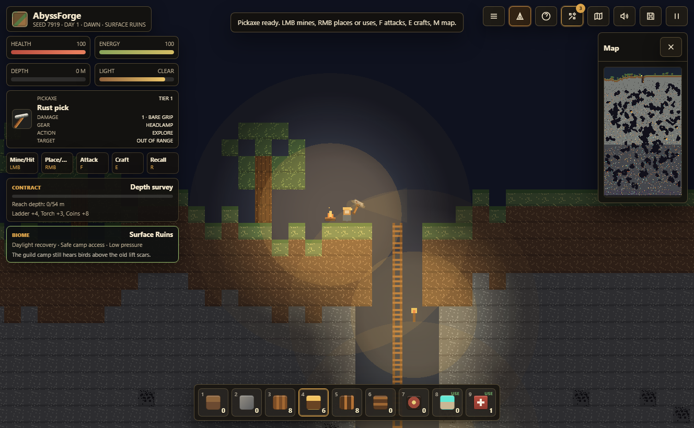
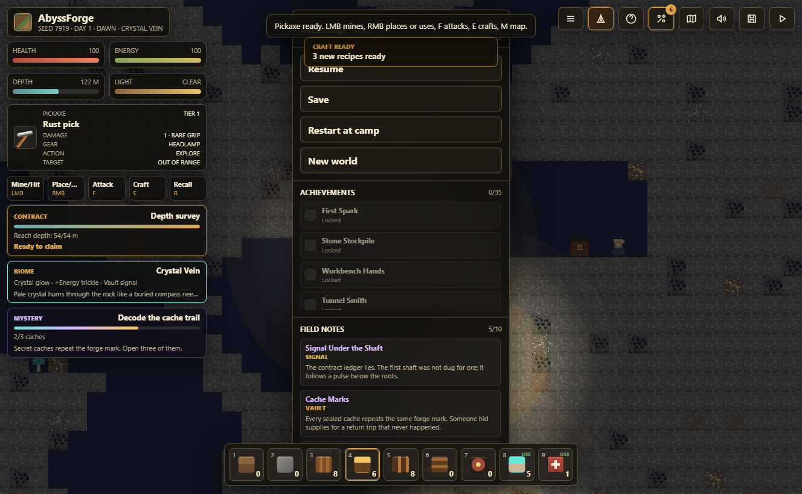
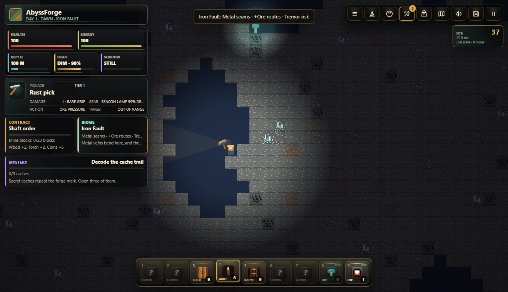

# AbyssForge

**AbyssForge** is a browser-based 2D mining, crafting, survival, and descent game about turning a ruined surface camp into a lifeline through a hostile living mine.

You start with a weak pick, a few torches, and a campfire beside the first shaft. Every trip downward changes the run: new resources unlock tools, campfires become anchors, biome pressure changes recovery and light rules, secrets hide bosses, and the mine pushes back with events, mobs, darkness, and contracts.



## Game Fantasy

The old lift network under the Guild is broken. Below it, the mine is not just deeper rock - it is a layered machine of roots, ore faults, glow hollows, crystal veins, and obsidian heat. Campfires are the only reliable marks of human control. Light buys time. Crafting buys options. Going deeper buys answers.

The long-term goal is to recover enough relic technology to reach the Warden's forge and survive what the first expedition woke up.

## Hidden Purpose

At first, AbyssForge plays like a direct mining game: dig, craft, light the route, and survive. The deeper structure is deliberately hidden. Reaching suspicious depths, opening secret caches, activating campfire waypoints, entering strange biomes, crafting relic systems, and defeating vault bosses decode field notes that slowly reframe the run.

The hidden thread asks the player to rebuild the old wayfire network, decode cache marks, assemble abyss gear, break two sealed bosses, and eventually learn what the forge was actually built to do.



## Core Loop

- Mine blocks, ores, mushrooms, and hidden caches.
- Craft picks, lamps, weapons, movement gear, charms, bridges, charges, and survival kits.
- Build ladders, platforms, torches, and safer descent routes.
- Rest at campfires to heal, recover energy, set respawn anchors, and resupply.
- Complete expedition contracts for supplies and coin.
- Discover secret rooms with chests, camp points, relics, and bosses.
- Push through deeper biomes where darkness, recovery, and music change with the terrain.
- Decode hidden field notes that reveal the Warden, the wayfires, and the true purpose of the abyss forge.

## Biomes With Properties

Biomes are runtime systems, not only labels. The current biome affects ambient light, recovery rate, energy pressure, darkness damage, situational music, and the HUD intel panel.

| Biome | Identity | Gameplay Effect |
| --- | --- | --- |
| Surface Ruins | Last honest sky | Safe camp access, daylight recovery, low pressure. |
| Rootline Burrows | Soft earth | Easier recovery and early route building around roots and soil. |
| Stone Warrens | Working mine | Stable midgame rock with balanced threats and coal routes. |
| Fungal Hollow | Living light | Glow caps raise local light and recovery, but slime routes become common. |
| Iron Fault | Ore pressure | Richer metal paths with lower recovery and tremor-like tension. |
| Deepstone Pressure | Heavy dark | Stronger darkness pressure, heavier mobs, weaker natural recovery. |
| Crystal Vein | Vault signal | Crystal glow and energy trickle mark valuable secret routes. |
| Obsidian Abyss | Boss country | Severe darkness, lava heat, and late-game Warden territory. |



## Current Features

- Seeded procedural world with a quality-gated spawn area.
- Stable starter shaft, no-air spawn checks, and a protected first drop bridge.
- Mining, block placement, ladders, torches, platforms, charges, and hotbar use.
- Pickaxe combat against crawlers, slimes, bats, golems, and hidden bosses.
- Expanded crafting across tools, blocks, survival items, and relic upgrades.
- Campfire rest points with warm light, services, safe respawn anchors, and recall support.
- Secret vault rooms with chests, rare relic materials, boss rooms, and deeper camp points.
- Dynamic cave events: ore surge, lantern draft, depth swarm, and cave tremor.
- Situational music modes for surface, night, caves, danger, treasure, camp, deep zones, and bosses.
- Hidden field-note system with staged long-term goals, lore reveals, and a mystery HUD that appears only after the first impossible clue.
- Achievements, unlock toasts, craft-ready notifications, contracts, minimap, pause menu, and death recap.
- Local Playwright smoke test covering spawn quality, progression data, camp anchors, biome variety, and hidden-lore progression.

## Controls

| Input | Action |
| --- | --- |
| `A` / `D` | Move left and right |
| `W` / `Space` | Jump or climb up |
| `S` | Climb down ladders or drop through normal platforms |
| `Shift` | Sprint while energy allows |
| Left mouse | Mine blocks or hit an enemy under the cursor |
| Right mouse | Place or use the selected hotbar item |
| `F` | Swing the pickaxe at enemies in front of you |
| `R` | Recall to the active campfire anchor |
| `C` | Open camp services while near a campfire |
| `E` | Open crafting |
| `1`-`9` | Select hotbar slot |
| `M` | Toggle map |
| `Esc` | Pause or resume |

## Run Locally

Open `index.html` directly in a browser, or serve the folder with any static file server.

```bash
npm install
npm test
```

`npm test` launches Playwright, opens the game, verifies 300 generated starts, checks that the spawn has real support, confirms the starter camp is reachable, validates campfire anchors and progression systems, and samples biome variety in the runtime.

## Project Shape

- `index.html` - Phaser host page and HUD markup.
- `css/style.css` - pixel-art UI, panels, hotbar, drawers, and responsive layout.
- `js/config.js` - shared constants, items, recipes, contracts, achievements, enemies, and events.
- `js/sim.js` - pure world simulation, generation, saves, inventory, crafting, contracts, mobs, and spawn repair.
- `js/biomes.js` - biome definitions, detection, lore, and gameplay properties.
- `js/camp.js` - campfire proximity, anchor, respawn, and service logic.
- `js/audio.js` - Web Audio SFX and situational music modes.
- `js/textures.js` - generated pixel textures and sprites.
- `js/ui.js` - DOM HUD, crafting drawer, minimap, toasts, achievements, and death panel.
- `js/scene.js` - Phaser gameplay scene, movement, mining, combat, lighting, hazards, events, and camera.
- `scripts/verify-spawn-seeds.js` - browser smoke test and spawn/progression quality gate.

## Design Direction

AbyssForge is moving toward a deeper Terraria-like expedition structure: each descent should force a route decision, each biome should change the rules slightly, and every campfire should feel like a meaningful foothold in a hostile vertical world.
