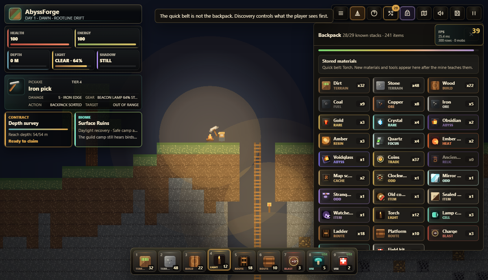
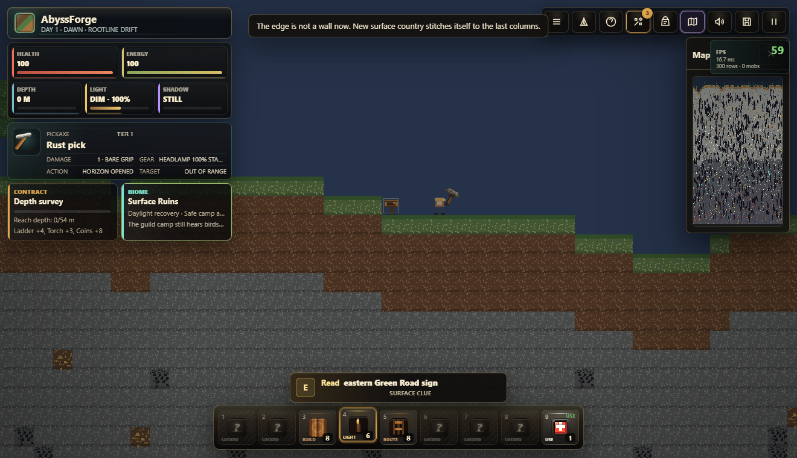

# AbyssForge

**AbyssForge** is a browser-based 2D mining, crafting, survival, and exploration game about a ruined guild expedition, a living mine, and a surface that refuses to stay mapped.

At first it looks like a compact Minecraft/Terraria-like mining game: dig down, place ladders, craft better tools, manage light, and bring loot back to camp. The longer you play, the more the game shifts. The map expands sideways and downward, campfires become waypoints, strange cache marks begin to repeat, mobs start reacting to more than proximity, and a hidden Watcher appears at the edge of your light without attacking.


## Why It Exists

AbyssForge is built around one product promise:

**Every trip should answer one question and create the next one.**

The player should always have a practical reason to continue - a better pick, a safer descent route, a camp to claim, a contract to finish, a chest to open, a biome to survive, or a horizon to push past. Under that readable survival loop sits a slower mystery about why the old forge network was built and why something in the mine seems aware of the player.

## Current Build Snapshot

| System | Current Scope |
| --- | ---: |
| Item catalog | 33 items |
| Crafting recipes | 65 recipes |
| Achievements | 63 achievements |
| Runtime biomes | 8 biomes |
| Depth strata | 5 strata |
| Surface regions | 6 region types |
| Chest loot tables | 12 contextual tables |
| Cave events | 4 event families |
| Enemy archetypes | 7 mob/boss types |
| Hidden lore | 19 notes, 8 goals |
| External asset layer | 25 packed CC0 image assets, 17 normalized runtime textures |

## Game Pillars

### 1. Mine, Build, Return

The first layer is tactile and immediate. The player mines blocks, places ladders and platforms, drops torches, opens chests, fights with a pickaxe, and returns to camp when the route becomes unsafe. The hotbar is only the quick belt; the full backpack opens as the expedition learns new materials.



### 2. Light Is A Resource

Torches, campfires, glow caps, and battery-fed lamps all matter. The lamp no longer behaves like a permanent upgrade: it has charge, battery refill logic, standby behavior near external light, and failure states in deep darkness. Low light builds **Shadow pressure** before it becomes lethal, which gives the player time to react and makes dark zones feel mechanically different instead of only darker.

### 3. The World Expands

The world is not supposed to stop at a hard edge. Reaching the left or right horizon opens a new side region that reads the existing edge columns, continues terrain, carries cave openings forward, and adds surface or underground points of interest based on procedural rules.



### 4. Biomes Change Rules

Biomes are runtime systems, not decorative names. They affect light floors, recovery, energy pressure, darkness damage, enemy pressure, music, and HUD intel.


### 5. The Mine Watches Back

The hidden story is intentionally not frontloaded. Field notes unlock through suspicious depths, secret caches, strange biomes, campfire anchors, boss progress, and Watcher sightings. The Watcher does not attack. It appears at the edge of vision, retreats from strong light and camps, leaves traces, and slowly reframes the mine as something built for more than ore.


## Player Journey

1. **Secure the first shaft.** Learn movement, mining, ladders, torches, campfire rest, and the safe starter descent.
2. **Stabilize the route.** Gather stone, coal, copper, wood, mushrooms, gel, coins, and basic loot while crafting better survival options.
3. **Build anchors.** Find or create campfire footholds, set respawn anchors, and use camp services to recover and resupply.
4. **Push the strata.** Open deeper seams where ore weights, cave shape, lava pressure, mobs, and cache rarity shift.
5. **Read the wrong details.** Open secret caches, find repeated symbols, trigger field notes, and notice that some messages are not written to the miner.
6. **Cross the map edge.** Explore left and right into new surface regions, old roads, dead groves, villages, watcher fields, and side-country caves.
7. **Assemble the truth.** Craft relic systems, defeat hidden bosses, rebuild the wayfire network, and learn what the abyss forge was built to preserve.

## World Generation

AbyssForge now uses a dedicated **WorldGen Director** instead of scattering every landmark and loot rule through the simulation. It controls surface pacing, contextual chest tables, biome-aware spawn budgets, and region-specific setpieces.

### Surface Regions

| Region | Role | What It Adds |
| --- | --- | --- |
| Green Road | Early quiet travel | Sparse road signs, trees, safe terrain, basic surface caches. |
| Broken Road | First uncertainty | Wayposts, broken platforms, old road material, route hints. |
| Dead Grove | Suspicious forest | Lower tree density, dead trunks, amber and letter cache chances. |
| Sunken Lowland | Soft ground | Mushrooms, gel, battery chances, lower terrain pockets. |
| Unlit Village | Far surface reward | Abandoned shelters, richer lockboxes, strange letters, keys. |
| Watcher Field | Late surface anomaly | Obsidian marks, watcher-token cache rolls, wrong-shadow messaging. |

### Depth Strata

| Stratum | Starts Near | Expedition Meaning |
| --- | ---: | --- |
| Rootline Drift | 0 m | Forgiving starter rock with roots, coal, copper, safe routes, and more camps. |
| Iron Fault | 72 m | Ore-rich pressure shelves with longer mining pulls and tremor risk. |
| Crystal Vein | 138 m | Valuable glow chambers with stronger detours, crystals, and signal lore. |
| Obsidian Abyss | 220 m | Boss country with harsher darkness, lava heat, and rare abyss cache rolls. |
| Voidglass Shelf | 330 m | Repeating lower shelves where the mine stops behaving naturally. |

### Runtime Biomes

| Biome | Identity | Gameplay Effect |
| --- | --- | --- |
| Surface Ruins | Last honest sky | Safe camp access, daylight recovery, low pressure. |
| Rootline Burrows | Soft earth | Easier recovery and early route building around roots and soil. |
| Stone Warrens | Working mine | Stable midgame rock with balanced threats and coal routes. |
| Fungal Hollow | Living light | Glow caps raise local light and recovery, but slime routes become common. |
| Iron Fault | Ore pressure | Richer metal paths with lower recovery and tremor tension. |
| Deepstone Pressure | Heavy dark | Stronger darkness pressure, heavier mobs, weaker recovery. |
| Crystal Vein | Vault signal | Crystal glow and energy trickle mark valuable secret routes. |
| Obsidian Abyss | Boss country | Severe darkness, lava heat, and late-game Warden territory. |

## Core Systems

- **Mining and placement:** blocks, ladders, platforms, torches, charges, glow caps, and usable kits.
- **Crafting progression:** recipe visibility opens through discovery, not a full catalog dump on spawn.
- **Backpack and quick belt:** the bottom bar is immediate access; the backpack is the larger material memory.
- **Controlled asset pipeline:** the base style stays canvas-first, while approved CC0 sprites are packed into a local runtime bundle, normalized into item, chest, and mob textures, and checked by hash before use.
- **Contextual loot:** surface, road, grove, lowland, village, watcher, cave, fungal, iron, crystal, abyss, and secret chest tables.
- **Campfires:** rest, heal, recover energy, set respawn anchors, and support recall routes.
- **Contracts:** short expedition orders provide direction and rewards.
- **Achievements:** unlocks track survival, depth, crafting, exploration, secrets, lore, and anomalies.
- **Enemy ecology:** cave mobs, surface mobs, bosses, and ambushes have spawn rules by layer, depth, biome, and sightline.
- **Smarter mobs:** enemies react to light, noise, weakness, allies, line of sight, nearby POI, and their own health.
- **Cave events:** ore surge, lantern draft, depth swarm, and tremor events vary with story phase.
- **Hidden lore:** field notes, mystery panel, wayfire goals, cache marks, Warden clues, and Watcher sightings.
- **Situational music:** surface, night, cave, danger, treasure, camp, deep, and boss moods.
- **Performance guardrails:** cached HUD rendering, throttled lightmap redraws, and Playwright FPS/frame-time checks.

## Controls

| Input | Action |
| --- | --- |
| `A` / `D` | Move left and right |
| `W` / `Space` | Jump or climb up |
| `S` | Climb down ladders or drop through normal platforms |
| `Shift` | Sprint while energy allows |
| Left mouse | Mine blocks or hit an enemy under the cursor |
| Right mouse | Place or use the selected hotbar item |
| `E` | Open chests, read signs, use campfires, or open crafting |
| `F` | Swing the pickaxe at enemies in front of you |
| `R` | Recall to the active campfire anchor |
| `C` | Open camp services near a campfire |
| `B` / `I` | Open the backpack |
| `1`-`9` | Select hotbar slot |
| `M` | Toggle map |
| `Esc` | Pause or resume |

## Run Locally

Open `index.html` directly in a browser, or install dependencies and run the verification suite:

```bash
npm install
npm test
```

Regenerate product README screenshots from the current build:

```bash
npm run docs:screenshots
```

Refresh external CC0 candidates, rebuild the local runtime bundle, and audit licenses/hashes:

```bash
npm run assets:all
```

## Verification

`npm test` runs two Playwright-backed gates:

- `test:spawn` checks 300 generated seeds for spawn support, starter camp reachability, mob ecology rules, progression disclosure, chest interaction, vertical expansion, horizontal expansion, POI behavior, light/lamp behavior, lore hooks, Watcher runtime, combat line of sight, worldgen director content, and external asset runtime normalization.
- `test:perf` boots the game at 1280x720 and checks browser errors, RAF FPS, average frame time, p95 frame time, HUD DOM weight, minimap default state, canvas availability, and that the HUD has loaded external item icons.

## Project Shape

- `index.html` - Phaser host page and HUD markup.
- `css/style.css` - pixel-art UI, panels, hotbar, drawers, icons, and responsive layout.
- `js/config.js` - constants, tiles, items, recipes, strata, contracts, achievements, enemies, and cave events.
- `js/worldgen-director.js` - surface regions, landmark pacing, chest loot tables, and spawn budgets.
- `js/progression.js` - item knowledge, hotbar disclosure, recipe gates, and discovery signatures.
- `js/sim.js` - pure world simulation, generation, saves, inventory, crafting, contracts, mobs, and spawn repair.
- `js/biomes.js` - biome definitions, detection, lore, and gameplay properties.
- `js/poi.js` - surface and underground discoveries, readable marks, and placement rules.
- `js/camp.js` - campfire proximity, anchors, respawn, recall, and services.
- `js/audio.js` - Web Audio SFX and situational music modes.
- `js/asset-data.js` - generated local data-URL bundle for audited external images.
- `js/assets.js` - external asset preload, normalization, runtime texture, and item icon bridge.
- `js/textures.js` - generated pixel textures and sprites.
- `js/ui.js` - DOM HUD, crafting drawer, backpack, minimap, toasts, achievements, story, and death panel.
- `js/scene.js` - Phaser gameplay scene, movement, mining, combat, lighting, hazards, events, camera, and runtime interactions.
- `scripts/build-external-asset-data.js` - packs audited external images into `js/asset-data.js` for local HTML and Playwright runs.
- `scripts/verify-spawn-seeds.js` - spawn, systems, worldgen, and progression quality gate.
- `scripts/verify-hud-performance.js` - HUD and frame-time smoke gate.
- `scripts/capture-readme-images.js` - repeatable screenshot capture for README images.

## Direction

AbyssForge is moving toward a deeper expedition game: more meaningful side-country, rarer and smarter surface events, richer underground secrets, clearer biome identity, more reactive enemies, and a story that starts as mining work but gradually reveals that the miner, the mobs, and the Watcher all understand the player's presence in different ways.
